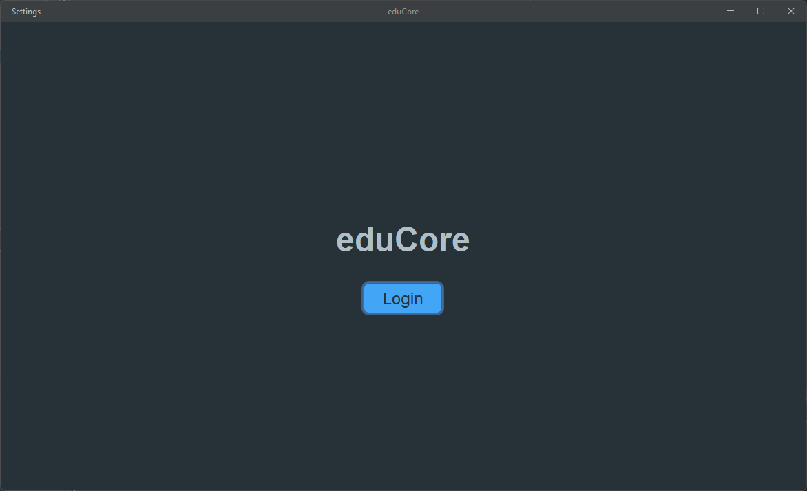
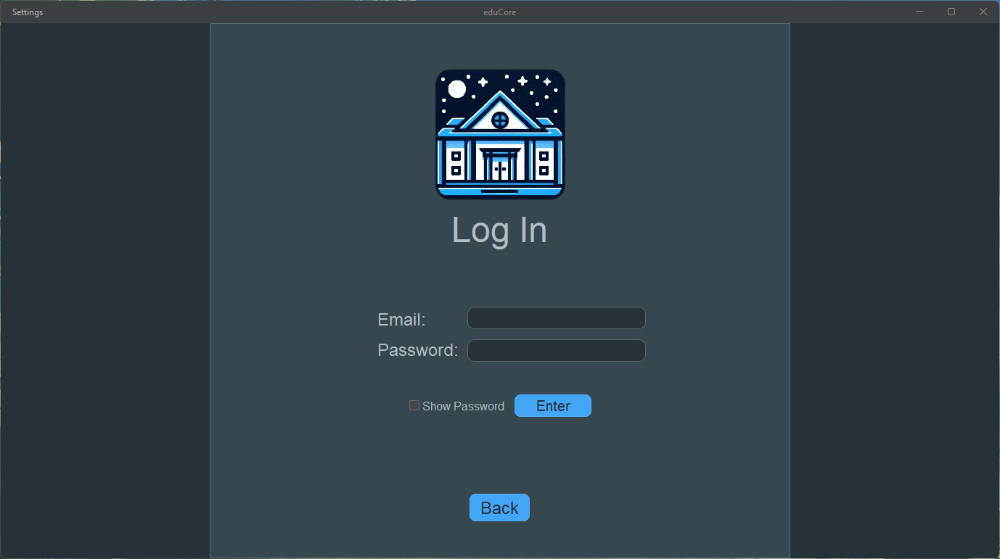
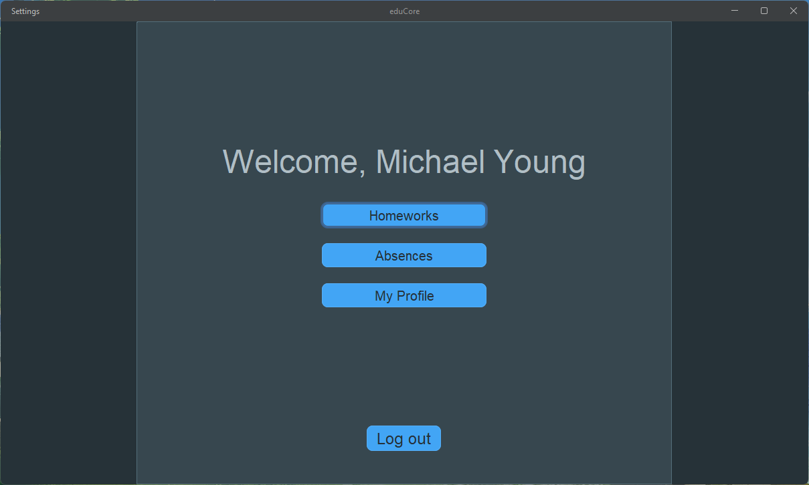
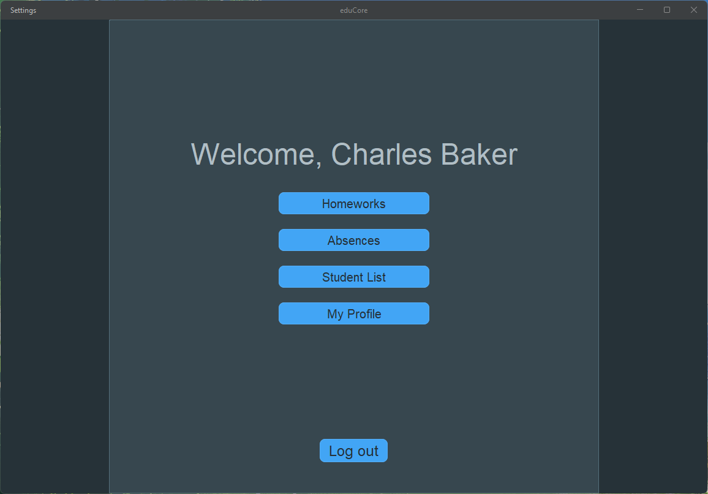
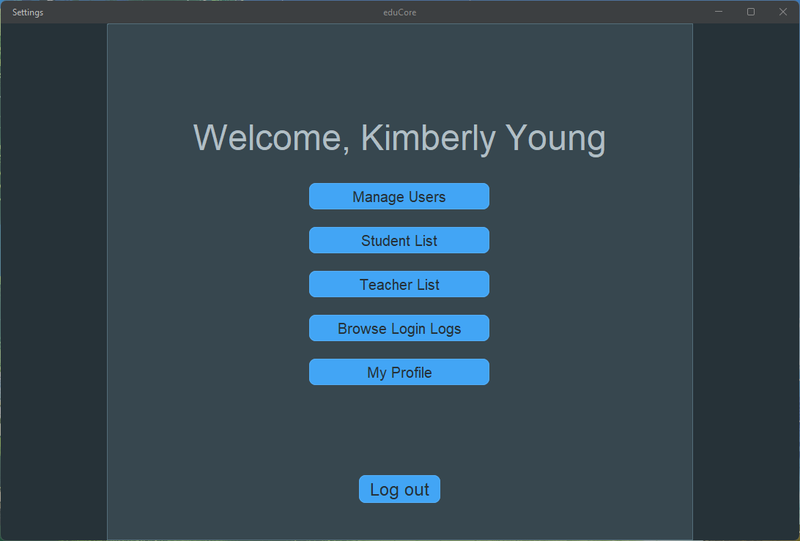
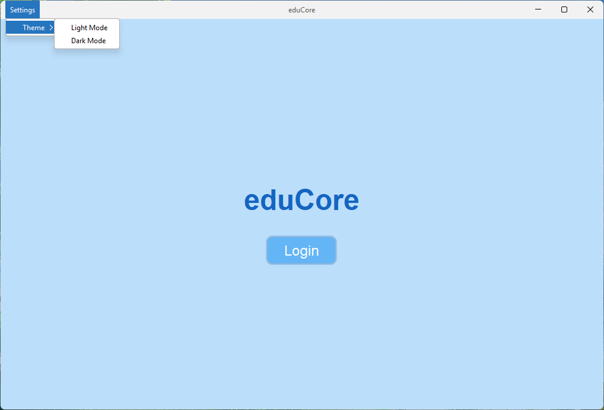

# eduCore

Többszerepkörös (student/teacher/admin) Java Swing asztali alkalmazás iskolai folyamatokhoz: bejelentkezés, szerepkör‑alapú navigáció, házi feladat‐kezelés és automatikus osztályzás, hiányzásigazolások, PDF export, valamint animált világos/sötét téma támogatás macOS finomhangolásokkal.

## Tartalomjegyzék
- Áttekintés
- Fő funkciók
- Technológiák
- Architektúra
- Telepítés és futtatás
- Használat
- Konfiguráció és adatok
- Képernyőképek
- Gyors indulás (dev)

## Áttekintés
Az eduCore célja egy letisztult és szerepkör‑tudatos felület biztosítása az oktatási adminisztráció mindennapi folyamataihoz.  
A rendszer a belépéstől a naplózásig, a házik kezelésétől a PDF exportokig egységes eszközkészletet kínál tanulóknak, tanároknak és adminoknak.

## Fő funkciók
- Bejelentkezés és munkamenet: e‑mail/jelszó autentikáció, jelenlegi felhasználói állapot, be/ki‑jelentkezés naplózása.  
- Szerepkör‑alapú UI: dinamikus kezdőoldal gombokkal (student/teacher/admin) a releváns funkciókhoz.  
- Házi feladatok: létrehozás, szerkesztés, törlés, beküldések és jegyek kezelése, határidővel.  
- Automatikus osztályzás: lejárt és be nem adott házik automatikus értékelése aszinkron hálózati idő alapján.  
- Hiányzásigazolások: igazolások rögzítése időintervallummal, típussal és jóváhagyási státusszal.  
- PDF export: tanulói/tanári belépők és felhasználói listák generálása iText-tel.  
- Témák és animáció: FlatLaf alapú Light/Dark, macOS natív dekoráció.  
- Ablakkezelés és navigáció: CardLayout, méretezés, menüsávos témaváltás.  
- Példaadatok: tömeges generátor diák/tanár/admin szerepkörökre.

## Technológiák
- Java 11+ Swing.  
- FlatLaf és FlatPropertiesLaf (animációval és testreszabott témákkal).  
- Gson a JSON‑alapú preferenciákhoz/adatokhoz.  
- iText PDF generáláshoz.  
- java.net.http HttpClient + CompletableFuture (aszinkron hálózati idő).  
- Dotenv az idő API kulcs betöltéséhez (.env).

## Architektúra
- Belépési pont: Main indítja az ablakkezelést és az opcionális automata osztályzást (async).  
- Ablakkezelés: WindowManager felel a CardLayout‑os oldalakért, témákért, menüért, méretezésért és platform‑specifikus finomhangolásért.  
- Auth réteg: AuthManager (hitelesítés), CurrentUser (munkamenet), LoginLogManager (belépési naplók).  
- Domain csomagok: users, homework, absence, log – entitások + manager osztályok tiszta felelősségi körrel.

## Telepítés és futtatás
- Követelmények: Java 11+ (HttpClient támogatás miatt ajánlott).  
- Környezet: hozz létre egy `.env` fájlt a projekt gyökerében TIME_API_KEY kulccsal (TimeZoneDB).  
- Futtatás: indítás IDE‑ből a `Main` osztályból; az ablak és oldalak inicializálása automatikus.  
- Preferenciák: téma JSON‑ban tárolva (első futáskor létrejön: `data/preference.json`).

    Példa `.env`: `TIME_API_KEY=SAJAT_TIMEZONEDB_KULCS`

## Használat
- Bejelentkezés: Landing → Login, e‑mail/jelszó; siker esetén szerepkör‑specifikus Home.  
- Témaváltás: Settings → Theme → Light/Dark (animációval és automatikus mentéssel).  
- Házi feladatok: létrehozás/szerkesztés/törlés, beküldés és értékelés szerepkör szerint.  
- Automata osztályzás: lejárt határidőknél fut, hálózati időt kér és hiányzó beküldésekre alapértelmezett jegyet ad.  
- PDF export: tanulói/tanári belépők és felhasználói listák generálása.

## Konfiguráció és adatok
- Hálózati idő: TimeZoneDB API hívás, timeout/hibatűrés, budapesti rendszeridő fallback.  
- Preferenciák: téma mentése/olvasása JSON‑ban Gson‑nal.  
- Adattárolás: felhasználók, házik, naplók, igazolások JSON‑on keresztül a Database rétegen át.

## Képernyőképek

### Landing és Login

  
  

### Szerepkör nézetek

  

    

### Témaváltás (Light/Dark)

  

## Gyors indulás (dev)
- Demo adatok: `ExampleDataGenerator.populateSystemWithExampleUsers(...)` nagyobb tesztbázishoz.  
- Automata osztályzás: `HomeworkAutoGrader.gradeAllOverdueHomework()` indításkor.
